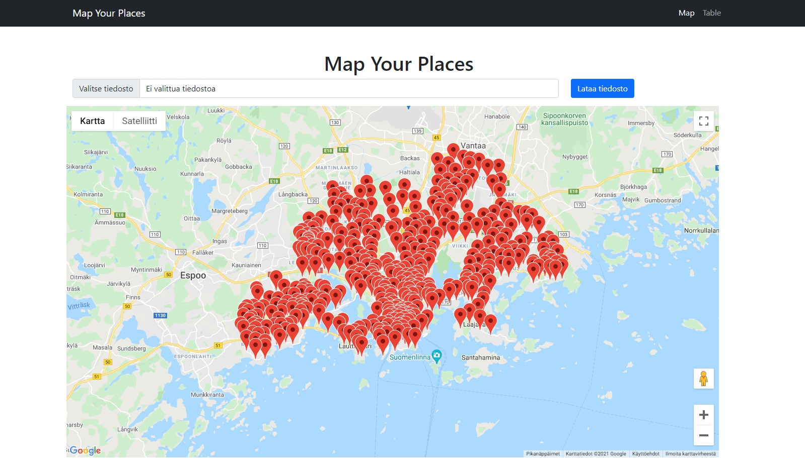
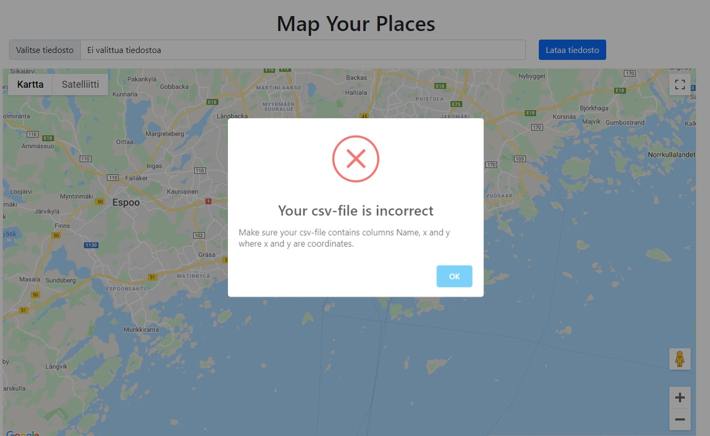

# Map your places

Locate your favorite places on google maps. Upload .csv -file that contains the required columns: *Name*, *x* and *y*, where *x* and *y* are coordinates and *Name* is the name you choose to give to that place. Map will be automatically centered with weighted average and show you those places on Google Maps.

## Map

Shows your mapped places on google map.

## Table

Shows your selected places names and coordinates.

## Task list

- [x] Install starter packages
- [x] Load csv-file rows to terminal
- [x] Create database
- [x] Read csv to database
- [x] Google Maps API
- [x] Front End
- [ ] Deploy to heroku

## Screenshots



Error, if requested columns were not found in csv-file



## Run Locally

Clone the project

```bash
  git clone https://github.com/AnttiEsa/MapYourPlaces.git
```

Go to the project directory

```bash
  cd MapYourPlaces
```

Install dependencies

```bash
  python -m pipenv install
```

Create .env -file (see the constructions from .env_example)

```bash
  touch .env
```

Start virtualenvironment
```bash
  python -m pipenv shell
```

Create database
```bash
  python create_db.py
```

Start local server
```bash
  python -m app
```

Run program
```bash
  http://127.0.0.1:5001/maps
```

## Authors

- [@anttiesa](https://www.github.com/anttiesa)

  
## License

[MIT](https://choosealicense.com/licenses/mit/)